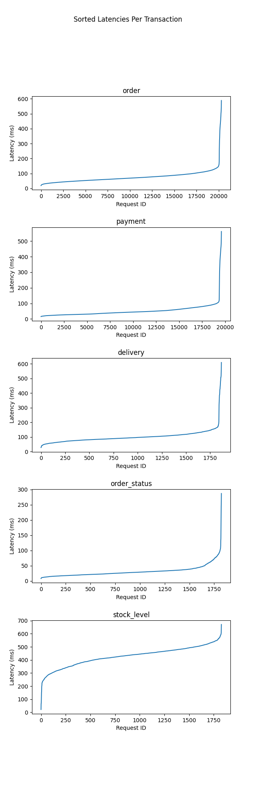

# TPC-C Web Server

A webserver based on the [TPC-C database benchmark](https://www.tpc.org/tpcc/default5.asp). It consists of 5 transaction
types interacting with a complex database mimicking a real-life use case.

The webserver provided routes are:

| Path                                  | Method | Body                                                            |
|---------------------------------------|--------|-----------------------------------------------------------------|
| /init_db    	                         | POST   | `{ "warehouses": 10 }`<br>_Optional. Defaults to WAREHOUSES._ 	 |
| /orders/                              | POST   | `{ "w_id": 1, "c_id": 1 }`                                      |
| /payment/                             | POST   | `{ "w_id": 1, "c_id": 1 }`                                      |
| /customers/{customer_id}/orders       | POST   |                                                                 |
| /warehouses/{warehouse_id}/deliveries | POST   |                                                                 |
| /warehouses/{warehouse_id}/stock      | GET    |                                                                 |

Notes:

1. All routes are `POST` requests
2. `w_id` is the warehouse id, `c_id` is the customer id

## How to run

### Docker

```shell
docker compose up -d
```

This builds and starts the webserver along with a single Postgres database. Please
check [docker-compose.yml](docker-compose.yml) for configuration details such as username, password, db name for
postgres and gunicorn config for server.

### Local

```shell
# Init
python -m virtualenv .venv
source .venv/bin/activate
pip install -r requirements.txt

# Set `DATABASE_URL` and `WAREHOUSES` environment variable as required.
export DATABASE_URL=postgresql://localhost/bench_sa
export WAREHOUSES=10 # Default: 10 

# Run
cd src/ && gunicorn --bind=localhost:5000 app:app
```

## Init Database

Initialise database with all tables according to TPC-C schema and fill up with seed data for warehouses, districts,
customers, etc.

```shell
curl --request POST http://localhost:5000/init_db
```

Optionally, you can also pass the amount of warehouses,

```shell
curl --request POST 'http://localhost:5000/init_db' \
    --header 'Content-Type: application/json' \
    --data '{
        "warehouses": 20
    }'
```

## LiteFS

```shell
./litefs/run.sh up # Docker up all
./litefs/run.sh down # Docker down all

# For more info
./litefs/run.sh help
```

### Experiment

5 Cloudlab instances with following specifications:

_TODO: Specifications_

| **Node** | **Purpose**      |
|----------|------------------|
| 0        | nginx            |
| 1        | primary          |
| 2        | replica          |
| 3        | replica          |
| 4        | benchmark client |

**Duration:** 30 minutes

### Results

**MQTh (Throughput of Orders Transaction)** = 11.28

| **Transaction**  | **P90** | **P95** | **P99** |
|------------------|---------|---------|---------|
| **order**        | 0.1102  | 0.1236  | 0.3309  |
| **payment**      | 0.081   | 0.0912  | 0.3046  |
| **delivery**     | 0.136   | 0.152   | 0.3888  |
| **order_status** | 0.0485  | 0.0672  | 0.0951  |
| **stock_level**  | 0.5132  | 0.5352  | 0.5705  |



## Acknowledgements

TPC-C code is based on [Python ORM Benchmark](https://github.com/DominovTut/Python_ORM_Benchmark/).